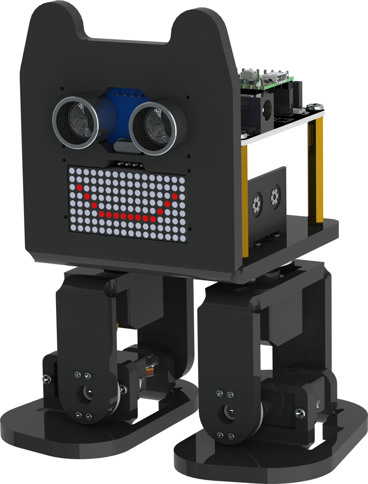
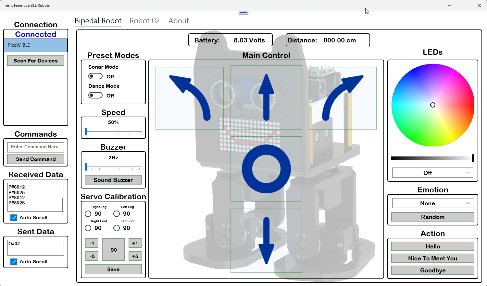

    <h1>Tim's Bipedal Robot Pico W BLE</h1>

## This is the firmware I modified from Freenove Bipedal Robot kit.  
It has been modified to work with the **Raspberry Pi Pico W** onboard BLE.  
Install it the normal way using Arduino IDE.

### Notes!
Using Arduino IDE make sure the following are set:
- **Board**: Raspberry Pi Pico (W)
- **Flash Size**: Sketch-1M, FS-1M
- **IP/Bluetooth Stack**: IPv4 + Bluetooth

I have also added command "O", this plays "song".  
- **O#\<song number\>#**
 
## I have also made a Windows Application that goes with this firmware.  
I have published the Application on Microsoft Store.  
You can find it here [Tim's BLE Robots](https://apps.microsoft.com/detail/9P4NQ460DG57?hl=en-us&gl=GB&ocid=pdpshare).

    

